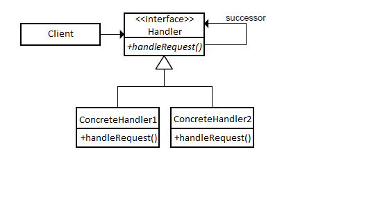

Chain of Responsibility
=======================

تعریف
-----
در الگوی طراحی Chain of Responsibility ما ساختاری رو تعریف می کنیم که در اون چندین آبجکت مسئول
پاسخ گویی و پردازش یک درخواست میشن.

زمانی که یک درخواست ایجاد میشه در زنجیره یا Chain حرکت می کنه تا زمانی که یک آبجکت پیدا بشه که بتونه درخواست رو پاسخ
بده.

اجزاء
-----
الگوی طراحی Chain of Responsibility از چند بخش اصلی تشکیل میشه:

1.   Concrete Handlers: پیاده سازی هندل کننده های مورد نظر

2.   Adaptee: کلاسی که می بایست آداپته شود.

3.   Client

Olimpiu.pop, CC BY-SA 3.0, via Wikimedia Commons

چه زمانی استفاده میشه؟
----------------------

این الگو زمانی در برنامه استفاده میشه که چندین آبجکت امکان هندل کردن یک درخواست رو داشته باشن اما دقیقا مشخص نباشه که
کدوم مسئول این کار هست.

زمانی رو تصویر کنید که یک فرد با قسمت پشتیبانی یک مرکز تماس میگیره و نفر اول نمیتونه مشکلش رو حل کنه و ارجاع میده به
نفر بعد و این فرآیند تا زمانی ادامه پیدا می کنه که مشکل حل بشه.

در حالت دیگه به این صورت استفاده میشه که هر کدوم به نحوی تاثیری روی درخواست میگذارن و اون رو به نفر بعد میدن.

.. caution::
   .. centered:: ✅ مزایای استفاده
   *.   امکان مدیریت روی ترتیب request handling

   *.   رعایت اصل Open/Closed از اصول Solid: اضافه شدن handler های جدید باعث تغییر ساختار کد نمیشه

   *.   رعایت اصلی تک مسئولیتی از اصول SOLID با جداسازی کلاس عملیاتی از منطق برنامه

.. warning::
   .. centered:: ❌ معایب استفاده
   این امکان وجود داره که بعضی از درخواست ها از کل زنجیره عبور کنن بدون اینکه handle بشن

کاربرد عملی
-----------
مطرح ترین و شناخته شده ترین مثالی که از الگوی طراحی Chain of Responsibility شناخته میشه، HTTP request middleware هست.

پیاده سازی این ساختار رو میشه در اکثر فریمورک های مطرح PHP هم دید.

ساختار کلی این الگو در فریمورک لاراول رو با هم بررسی می کنیم.

پیاده سازی
-----------
خب هر Middleware باید چنین الگویی داشته باشه:

.. literalinclude:: Middleware.php
   :language: php
   :linenos:

و پیاده سازی ها در لاراول به این شکل هست:

.. literalinclude:: Middlewares.php
   :language: php
   :linenos:

هر Middleware درخواستی که دریافت کرده را پردازش و درخواست را به Middleware بعد منتقل می کند.

این زنجیره یا chain میان Middleware ها از طریق Kernel ایجاد می شود:

.. literalinclude:: Kernel.php
   :language: php
   :linenos:

در اینجا متد handle از متد array_reduce استفاده می کنه که به صورت ترتیب برعکس روی آرایه Middleware ها حرکت می کنه و
به ترتیب نتیجه رو از یک Middleware به دیگری میده تا در نهایت request نهایی برگرده.

نحوه فراخوانی
-------------

.. literalinclude:: Call.php
   :language: php
   :linenos:

درخواست به متد handle داده می شود تا زنجیره ی Middleware ها به ترتیب درخواست را handle کنند.

مثال دوم
--------

یا مثال دیگه میتونه حالتی باشه که بحث احراز هویت کاربر رو داریم توسط Middleware ها بررسی می کنیم.

در سطح اول زنجیره، اطلاعات ورود کاربر رو بررسی می کنیم و در سطح دوم سطح دسترسی کاربر به بخش مورد نظر و...