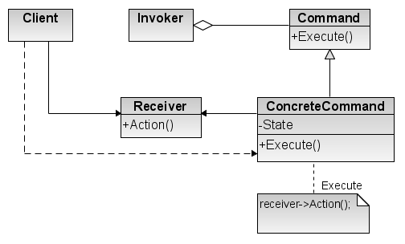

Command
=======

تعریف
-----
دیزاین پترن Command یک الگوی رفتاری محسوب میشه که به ما اجازه میده درخواست (Request) رو به صورت یک آبجکت دربیاریم تا
بتونیم با این کار بخش ارسال کننده ی درخواست و بخش اجرا کننده ی درخواست رو از هم جدا کنیم.

یکی از مثال های معروفی که برای این دیزاین پترن داریم ساختار یک رستوران هست، به این صورت که مشتری سفارش خودش رو به
گارسون میده و گارسون هم سفارش رو به آشپزخانه رستوران میبره تا اجرا بشه.

اینجا سفارش میشه همون Request یا Command و با این کار بخش سفارش دهنده (مشتری) و انجام دهنده سفارش (آشپزخانه رستوان)
از هم جدا میشه.

چه زمانی استفاده میشه؟
----------------------
در کل این دیزاین پترن میشه گفت که بسیار پر کاربرد هست و در موارد مختلفی استفاده میشه.

اما معمولا در چه مواردی استفاده میشه؟

یکی از کاربردهای اون زمانی هست که قصد دارید درخواست خودتون رو به صورت آبجکت دربیارید و اون رو به عنوان ورودی در
اختیار متد مورد نظرتون قرار بدید.

کاربرد دیگه ی اون زمانی هست که قصد دارید در برنامه خودتون queue ها رو پیاده سازی کنید و اون ها رو Schedule کنید یا
اون ها رو به صورت Remote اجرا کنید.

و مورد دیگه ی استفاده ی این دیزاین پترن زمانی هست که قصد دارید امکان undo کردن یک دستور رو فراهم کنید، در این حالت
کافیه یک متد undo به interface مربوط به Command اضافه کنید و تمام دستورات رو مجبور کنید این متد رو پیاده کنن.

اجزاء
-----
الگوی طراحی Command از چند بخش اصلی تشکیل میشه:

ابتدا **Command Interface** رو داریم که مشخص می کنه هر دستور در برنامه باید چه متدهایی رو پیاده کنه.

بخش بعد خود **دستورات** هستن که همگی Interface بالا رو پیاده سازی می کنن.

بعد از اون بخشی رو داریم که مدیریت اجرای دستورات رو بر عهده داره و زمانی که لازم باشه متد execute مربوط به دستورات رو
فراخوانی می کنه، نام این بخش **Invoker** هست.

قسمت بعد **Receiver** هست که در واقع آبجکتی هست که عملیات درخواستی رو اجرا می کنه و به عنوان پارامتر برای دستور ارسال
میشه.

در نهایت هم که مثل همیشه **Client** رو داریم که Request رو برای اجرا initiate می کنه.

Mormat 13:11, 13 April 2007 (UTC), CC BY-SA 3.0, via Wikimedia Commons

.. caution::
   .. centered:: ✅ مزایای استفاده
   امکان مدیریت روی ترتیب request handling

   رعایت اصل Open/Closed از اصول Solid: امکان اضافه کردن دستورات جدید بدون تغییر در کد Client

   رعایت اصلی تک مسئولیتی از اصول SOLID طبق توضیحاتی که داده شد

   امکان پیاده سازی undo/redo

   امکان به تعویق انداختن اجرای دستورات و پیاده سازی صف

   امکان ترکیب دستورات ساده و ایجاد یک دستور پیچیده

.. warning::
   .. centered:: ❌ معایب استفاده
   پیچیده شدن کد به علت تعریف انواع کلاس های جدید بین ارسال کننده دستور و دریافت کننده

کاربرد عملی
-----------
خب به عنوان مثال میتونیم تصور کنیم که در برنامه خودمون قرار هست یک صف از دستورات ایجاد کنید و به ترتیب اون ها رو اجرا
کنیم.

پیاده سازی
-----------
ابتدا Interface مربوط به دستورات رو ایجاد می کنیم:

.. literalinclude:: Command.php
   :language: php
   :linenos:

و بعد هم دستورات رو به این شکل تعریف می کنیم:

.. literalinclude:: Commands.php
   :language: php
   :linenos:

کلاس Receiver که عملیات مورد نظر دستورات رو اجرا می کنه به این صورت تعریف میشه:

.. literalinclude:: Receiver.php
   :language: php
   :linenos:

و از این Invoker رو تعریف می کنیم که کارش مدیریت دستورات هست:

.. literalinclude:: Invoker.php
   :language: php
   :linenos:

همونطور که میبینید یک لیست از دستورات و undo ها داره و اون ها رو به ترتیب اجرا می کنه.

نحوه فراخوانی
-------------

.. literalinclude:: Call.php
   :language: php
   :linenos:

این ساختار در بسیاری از فریمورک های مطرح برای پیاده سازی صف ها به همین شکل استفاده میشه.