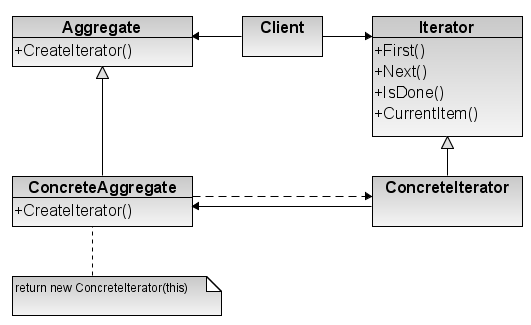

Iterator
========

تعریف
-----
دیزاین پترن Iterator یک الگوی رفتاری محسوب میشه که به شما اجازه میده به المان های یک مجموعه به صورت متوالی دسترسی
پیدا کنید و روی اون ها پیمایش انجام بدید بدون اینکه جزئیات لایه های زیرین نحوه ی پیاده سازی این ساختار برای لایه های
سطح بالای برنامه آشکار بشه.

همچنین به راحتی میشه بدون دست زدن به ساختار کد، المان هایی رو به مجموعه اضافه کرد.

چه زمانی استفاده میشه؟
----------------------
این دیزاین پترن معمولا زمانی استفاده میشه که مجموعه یا Collection پیچیده ای داریم که قصد داریم این پیچیدگی رو از منطق
اصلی برنامه جدا کنیم.

این الگو به نحوی پیاده سازی میشه که ما امکان پیمایش روی انواع ساختار های داده رو داشته باشیم و نوع این ساختار برای
سطوح بالا اهمیتی نداره.

اجزاء
-----
الگوی طراحی Iterator از چند بخش اصلی تشکیل میشه:

اولین بخشی که تعریف می کنیم **Iterator Interface** هست که ساختار iterator های پیمایش کننده ساختار های داده ای رو مشخص
می
کنه.

بخش بعد هم **پیاده سازی های مختلف Iterator ها** هست که از ساختار Interface پیروی می کنن و برای پیمایش روی داده ها به
کار
میرن.

بعد از این **Aggregate** رو داریم که Interface مربوط به ساختار داده ای که قرار هست روی اون پیمایش انجام بشه رو مشخص می
کنه.

و **بعد پیاده سازی های Aggregate** رو داریم که قرار هست روشون پیمایش انجام بشه و یک متد هم برای دریافت iterator دارن.

در نهایت هم که مثل همیشه **Client** رو داریم که قراره کلاس های ما رو صدا بزنه و از اون استفاده کنه.

Kostyantyn Kolesnichenko, Public domain, via Wikimedia Commons

.. caution::
   .. centered:: ✅ مزایای استفاده
   امکان مدیریت روی ترتیب request handling

   رعایت اصل Open/Closed از اصول Solid: امکان اضافه کردن انواع جدید Collection ها و iterator ها بدون تغییر Client

   رعایت اصلی تک مسئولیتی از اصول SOLID طبق توضیحاتی که داده شد

   امکان پیمایش موازی یک Collection به صورت جداگانه

   امکان توقف پیمایش و سپس ادامه آن در زمان دلخواه

.. warning::
   .. centered:: ❌ معایب استفاده
   اعمال این الگو در مواردی که واقعا بهش نیاز نیست و Collection های پیچیده ای وجود نداره بسیار اشتباه هست

کاربرد عملی
-----------
این الگو یکی از پر کاربرد ترین الگوهای مورد استفاده در PHP و انواع فریمورک های اون هست و در ساختارهای زیادی برای
پیمایش و انجام عملیات روی انواع Collection ها مورد استفاده قرار میگیره.

ما یک نمونه Iteration رو در PHP به عنوان مثال در ادامه پیاده سازی می کنیم.

پیاده سازی
-----------
برای Interface ما از ساختارهای موجود در PHP یعنی Countable و Iterator استفاده می کنیم و نیاز به تعریف Interface اضافه
ای نیست.

پس مستقیم میریم سراغ کلاس User

.. literalinclude:: User.php
   :language: php
   :linenos:

بعد هم Collection یا List مربوط به User ها رو داریم که قراره روش پیمایش انجام بشه:

.. literalinclude:: UserList.php
   :language: php
   :linenos:

نحوه فراخوانی
-------------

.. literalinclude:: Call.php
   :language: php
   :linenos:

به همین زیبایی!