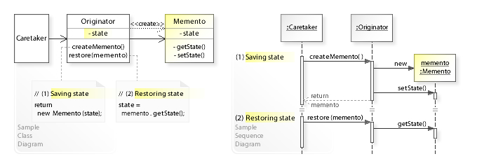

Memento
=======

تعریف
-----
دیزاین پترن Memento یک الگوی رفتاری محسوب میشه که امکان ذخیره و بازگردانی وضعیت قبل یک آبجکت رو به برنامه اضافه می
کنه بدون اینکه سطح بالای برنامه از نحوه پیاده سازی این الگو اطلاعی داشته باشه.

در واقع این الگو امکان undo و redo رو به برنامه اضافه می کنه.

چه زمانی استفاده میشه؟
----------------------
این الگو رو زمانی در برنامه استفاده می کنیم که نیاز به ذخیره کردن یک حالت خاص از برنامه و برگشت به اون حالت در زمان
دیگه داشته باشیم.

اجزاء
-----
الگوی طراحی Memento از چند بخش اصلی تشکیل میشه:

بخش اول این الگو **Originator** هست که وضعیت یا State اون می بایست ذخیره بشه.

بعد از اون **Memento** رو داریم که وضعیت Originator رو ذخیره می کنه.

و در نهایت هم **Caretaker** رو داریم که مسئول مدیریت آبجکت Memento و تاریخچه ی تغییر وضعیت های Originator هست.

Vanderjoe, CC BY-SA 4.0, via Wikimedia Commons

.. caution::
   .. centered:: ✅ مزایای استفاده
   امکان ذخیره سازی وضعیت آبجکت و برگشتن به آن در زمان مورد نظر

.. warning::
   .. centered:: ❌ معایب استفاده
   امکان مصرف بالای رم

   زبان های برنامه نویسی داینامیک مثل PHP نمیتونن تضمین کنن که وضعیت ذخیره شده در Memento دست نخورده باقی میمونه

کاربرد عملی
-----------
این الگو در زبان PHP کاربرد خیلی زیادی نداره و معمولا کاربرد اون در این زبان زیر سوال هست تا حدودی! چون در اکثر اوقات
ایجاد یک کپی از آبجکت با serialize کردن اون ساده تر هست!

بریم سراغ پیاده سازی عملی این الگو در PHP8 که مربوط میشه به یک Editor با قابلیت برگشت به وضعیت قبل

پیاده سازی
-----------
ابتدا کلاس Editor که همون Originator ما هست رو تعریف می کنیم:

.. literalinclude:: Editor.php
   :language: php
   :linenos:

بعد از اون کلاس Memento رو داریم:

.. literalinclude:: EditorMemento.php
   :language: php
   :linenos:

و در نهایت Caretaker:

.. literalinclude:: Caretaker.php
   :language: php
   :linenos:

نحوه فراخوانی
-------------

.. literalinclude:: Call.php
   :language: php
   :linenos:

به همین سادگی!