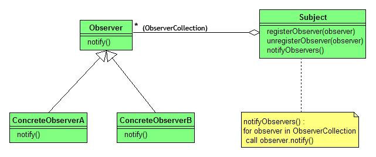

Observer
========

تعریف
-----
دیزاین پترن Observer یک الگوی رفتاری محسوب میشه که ساختار Publish/Subscriber رو در برنامه پیاده سازی می کنه.

در واقع زمانی که یک Subject وضعیتش تغییر می کنه، Observer ها که در لیست Subscriber ها قرار دارن رو به ترتیب از
تغییرات انجام شده مطلع می کنه.

کاربرد این الگو در کاهش ارتباط و وابستگی بین کلاس هاست.

چه زمانی استفاده میشه؟
----------------------
این الگو زمانی استفاده میشه که نیاز هست در برنامه با تغییر وضعیت یک آبجکت، وضعیت آبجکت های دیگه ای تغییر بکنه.

همچنین زمانی استفاده میشه که یک سری آبجکت در برنامه شما باید دیگر آبجکت ها رو Observe بکنن که این موضوع میتونه در
شرایط خاص یا در زمان های خاص باشه.

در این الگو چون لیست Subscriber ها داینامیک هست امکان اضافه شده و خارج شدن از این لیست در شرایط مختلف وجود داره.

اجزاء
-----
الگوی طراحی Observer از چند بخش اصلی تشکیل میشه:

بخش اول **Subject Interface** هست که ساختار کلی Subject ها رو مشخص می کنه و شامل متدهایی برای register، unregister و
مطلع
کردن Observer هاست.

بخش بعد **پیاده سازی های مربوط به Subject** هاست که لیستی از Observer ها رو هم نگهداری می کنن و زمانی که تغییری رخ داد
تمام Observer های register شده مطلع میشن.

بخش بعد **Observer Interface** هست که ساختار کلی Observer ها رو مشخص می کنه و معمولا شامل یک متد update هم هست که توسط
Subject می بایست فراخوانی بشه.

بخش بعد هم **پیاده سازی های Observer** ها هست که مشخصه ماجراش چیه!

From Wikimedia Commons, the free media repository

.. caution::
   .. centered:: ✅ مزایای استفاده
   رعایت اصل Open/Closed از اصول SOLID

   امکان ایجاد ارتباط میان آبجکت ها در زمان اجرا

.. warning::
   .. centered:: ❌ معایب استفاده
   اطلاع رسانی به Subscriber ها به ترتیب تصادفی صورت میگیرد

کاربرد عملی
-----------
این الگو در زبان PHP معمولا پر کاربرد هست و در فریمورک های مختلف هم دیده میشه.

به عنوان مثال در فریمورک لاراول در صورت تغییر وضعیت مدل ها، لیستی از Subscriber ها از این تغییرات مطلع میشن و موارد
مورد نظر رو انجام میدن.

در PHP با پیاده سازی Interface های SplSubject و SplObserver امکان پیاده سازی این الگو وجود داره.

پیاده سازی
-----------
خب ابتدا میریم سراغ پیاده سازی Publisher یا همون Subject:

.. literalinclude:: NewsPublisher.php
   :language: php
   :linenos:

میبینید که استفاده از SplObjectStorage کار ما رو بسیار راحت تر می کنه.

و بعد هم Subscriber یا Observer رو داریم:

.. literalinclude:: NewsSubscriber.php
   :language: php
   :linenos:

نحوه فراخوانی
-------------

.. literalinclude:: Call.php
   :language: php
   :linenos:

به همین سادگی!