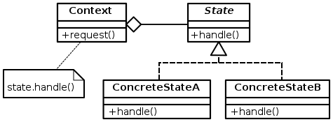

State
=====

تعریف
-----
دیزاین پترن State یک الگوی رفتاری محسوب میشه که به آبجکت اجازه میده رفتارش رو با توجه به وضعیت یا State داخلیش تغییر
بده.

الگوی State یک لیست از کلاس ها رو تعریف می کنه که نشان دهنده ی وضعیت های مختلفی هستن که یک کلاس میتونه داشته باشه و
همچنین یک Context کلاس داریم که به **آبجکت وضعیت فعلی** یک اشاره گر داره.

چه زمانی استفاده میشه؟
----------------------
این الگو زمانی مورد استفاده قرار میگیره که آبجکتی داریم که با توجه به وضعیت فعلیش رفتار های مختلفی از خودش نشون میده.

مثلا Cursor موس رو در نظر بگیرید که وقتی روی لینک ها قرار میگیره شکل و عملکردش عوض میشه!

اجزاء
-----
الگوی طراحی State از چند بخش اصلی تشکیل میشه:

بخش اول این الگو **Context** نام داره که نگهدارنده ی state object هست و با توجه به وضعیت فعلی، رفتارش عوض میشه.

مورد بعد **State** هست که یک Interface برای پیاده سازی های State ها محسوب میشه.

و در نهایت هم **پیاده سازی های State** ها رو داریم که مشخص کننده ی رفتار آبجکت در وضعیت های مختلف هستن.

State_Design_Pattern_UML_Class_Diagram.png: JoaoTrindade (talk)The original uploader was JoaoTrindade at English Wikipedia.derivative work: Ertwroc, CC BY-SA 3.0, via Wikimedia Commons

.. caution::
   .. centered:: ✅ مزایای استفاده
   نگهداری بهتر و ساده تر کد با جداسازی هر وضعیت -> اصل Open/Closed

   جداسازی رفتار یک آبجکت از وضعیت آن -> اصل تک مسئولیتی

   رفتار داینامیک: امکان تغییر رفتار آبجکت در زمان اجرا که باعث میشه حتی انعطاف پذیری بیشتری هم در برنامه بوجود بیاد

.. warning::
   .. centered:: ❌ معایب استفاده
   استفاده از اون در زمانی که فقط چند state محدود برای یک آبجکت داریم، اضافه کاری محسوب میشه و فقط کد رو پیچیده می کنه

کاربرد عملی
-----------
این الگو در PHP نسبتا کاربرد متوسطی داره و معمولا برای تبدیل State Machine های بزرگ به آبجکت ها استفاده میشه.

فرض کنید یک ادیتور داریم که متنی که در اون تایپ میشه میتونه حالات مختلفی داشته باشه.

این قابلیت از ادیتور رو میتونیم با استفاده از الگوی State پیاده سازی کنیم.

پیاده سازی
-----------
قبل از هر چیز Interface مربوط به State ها رو به این صورت داریم:

.. literalinclude:: WritingStateInterface.php
   :language: php
   :linenos:

بعد میریم سراغ انواع State هایی که میتونیم داشته باشیم:

.. literalinclude:: States.php
   :language: php
   :linenos:

و بعد هم TextEditor رو داریم:

.. literalinclude:: TextEditor.php
   :language: php
   :linenos:

نحوه فراخوانی
-------------

.. literalinclude:: Call.php
   :language: php
   :linenos:

به راحتی میشه State رو تغییر داد بدون اینکه Client از جزئیات نحوه پیاده سازی هر State خبر داشته باشه.