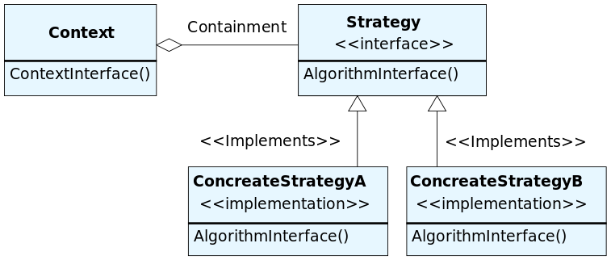

Strategy
========

تعریف
-----
دیزاین پترن Strategy یک الگوی رفتاری محسوب میشه که اجازه میده استراتژی های مختلفی رو در قالب یک سری آبجکت با interface
مشترک تعریف کنیم و با توجه به نیاز برنامه در زمان مورد نظر از هر کدوم استفاده کنیم.

در واقع به شما اجازه میده یک خانواده از الگوریتم ها رو در کلاس های مختلف تعریف کنید و کاری کنید که به راحتی قابل
جایگزینی با همدیگه باشن.

چه زمانی استفاده میشه؟
----------------------
این الگوریتم رو زمانی استفاده می کنیم که در برنامه امکان انجام یک عملیات از چند راه مختلف وجود داشته باشه و بخوایم از
راحت ترین راه ممکن استراتژی مورد نظر رو انتخاب کنیم.

این الگو رو زمانی استفاده می کنیم که تعداد زیادی کلاس مشابه هم داریم که فقط روش انجام عملیات مشابه شون با هم فرق می کنه.

اجزاء
-----
الگوی طراحی Strategy از چند بخش اصلی تشکیل میشه:

یک بخش به نام **Context** وجود داره که قراره از استراتژی های مختلف استفاده کنه.

یک **Strategy Interface** داریم که ساختار الگوریتم ها رو مشخص می کنه.

و در نهایت هم **انواع استراتژی های پیاده سازی شده** رو داریم که می بایست تعریف بشن.

Bocsika, CC0, via Wikimedia Commons

.. caution::
   .. centered:: ✅ مزایای استفاده
   امکان جا به جایی بین استراتژی ها در زمان اجرا

   جداسازی پیاده سازی الگوریتم ها از کدی که از آن استفاده می کند

   رعایت اصل Open/Closed: افزودن استراتژی بدون تغییر کد سطح بالا

.. warning::
   .. centered:: ❌ معایب استفاده
   اگر فقط تعداد محدودی استراتژی دارید که جایگزینی بین اون ها هم کمتر اتفاق میفته، استفاده از این الگو فقط کد رو
   پیچیده می کنه

   بخش Client باید از عملکرد استراتژی مورد نظر مطلع باشه تا بتونه استراتژی درست رو انتخاب کنه

   در بسیاری از زبان های برنامه نویسی میتوان به جای این الگو از Anonymous Function ها استفاده کرد

کاربرد عملی
-----------
این الگو در زبان PHP بسیار استفاده میشه مخصوصا زمانی که نیاز به جایگزینی الگوریتم ها در زمان اجرا با توجه به شرایط
مختلف و انتخاب های کاربر باشه.

فرض کنید قصد پیاده سازی سیستم تخفیف یک فروشگاه اینترنتی رو پیاده سازی کنیم.

در این شرایط با توجه به سطح کاربر استراتژی های مختلفی برای محاسبه تخفیف وجود داره.

با توجه به این موضوع میریم سراغ دیزاین پترن Strategy

پیاده سازی
-----------
قبل از هر چیز Interface مربوط به Strategy ها رو به این صورت داریم:

.. literalinclude:: DiscountStrategy.php
   :language: php
   :linenos:

و بعد استراتژی ها رو با متد مشترک محاسبه ی تخفیف پیاده سازی می کنیم:

.. literalinclude:: Strategies.php
   :language: php
   :linenos:

و بعد هم Context رو داریم که قراره از این استراتژی ها استفاده کنه:

.. literalinclude:: Context.php
   :language: php
   :linenos:

نحوه فراخوانی
-------------

.. literalinclude:: Call.php
   :language: php
   :linenos:

به این صورت خیلی راحت میشه استراتژی های جدید رو بدون تغییر کد Context اضافه کرد.