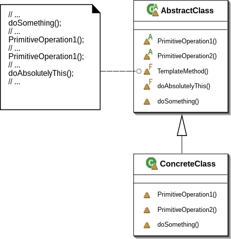

Template Method
===============

تعریف
-----
دیزاین پترن Template Method یک الگوی رفتاری محسوب میشه که اسکلت و ساختار الگوریتم رو در سوپرکلاس تعریف می کنه اما به
زیر کلاس ها اجازه میده بدون تغییر در ساختار الگوریتم، بخش هایی از الگوریتم رو تغییر بدن یا override کنن.

شما در فرآیند طراحی برنامه یک سری step ها رو مشخص می کنید تا در نهایت الگوریتم شما به نتیجه برسه، این قدم ها رو به
عنوان یک الگوی کلی در کلاس والد مشخص می کنید و اون ها رو به صورت متد های abstract، یا با یک پیاده سازی پیشفرض مشخص می
کنید و به زیرکلاس ها اجازه میدید هر کدوم قدم ها رو به شکل مورد نظر پیاده سازی کنن.

چه زمانی استفاده میشه؟
----------------------
این الگو معمولا زیاد استفاده میشه و احتمالا باهاش مواجه هم شدید.

از این الگو زمانی استفاده میشه که قصد داریم به زیرکلاس ها اجازه بدیم قدم های مشخصی از الگوریتم کلی رو به صورت دلخواه
پیاده سازی کنن.

این الگو زمانی در برنامه به کار میره که کلاس های زیادی در برنامه با الگوریتم تقریبا مشابه داریم که فقط بخش های خاصی
از اون ها با هم تفاوت داره.

اجزاء
-----
الگوی طراحی Template Method از چند بخش اصلی تشکیل میشه:

بخش اول این الگو **کلاس پایه ی Abstract** هست که الگوریتم کلی رو مشخص می کنه و یک ساختار کلی برای زیرکلاس ها تعیین می
کنه.

بخش بعد **زیرکلاس ها** هستن که تعاریف خودشون از الگوریتم کلی رو تعریف می کنن. البته در قسمت هایی که این اجازه بهشون داده
میشه.

و در نهایت هم **Client** رو داریم که از این دیزاین پترن استفاده می کنه.

Giacomo Ritucci, CC BY-SA 3.0, via Wikimedia Commons

.. caution::
   .. centered:: ✅ مزایای استفاده
   اجازه تغییر و override بخش های مشخصی از سوپرکلاس به زیرکلاس ها

.. warning::
   .. centered:: ❌ معایب استفاده
   ممکن است با تعریف interface نامناسب، اصل Liskov Substitution نقض بشه

   هر چقدر step های الگوریتم اصلی بیشتر باشه، نگهداری برنامه و الگو سخت تر خواهد شد

کاربرد عملی
-----------
کاربرد این دیزاین پترن رو معمولا در PHP به کرات میبینیم.

یکی از معمول ترین مواردی که استفاده از این الگو دیده میشه، گسترش و override کردن رفتارهای پیشفرض فریمورک با ارث بری هست.

در یک مثال عملی فرض کنید قصد داریم یک سیستم ناتیفیکیشن ایمیل رو پیاده سازی کنیم که برای کاربرد های مختلف متن و عنوان
متفاوتی داره.

پیاده سازی
-----------
ساختار کلاس Abstract و پایه ما به این صورت هست:

.. literalinclude:: EmailSender.php
   :language: php
   :linenos:

و بعد هم زیرکلاس ها رو به این صورت داریم:

.. literalinclude:: Subclasses.php
   :language: php
   :linenos:

که میشه دو نوع مختلف ایمیل با متن و عنوان متفاوت

نحوه فراخوانی
-------------

.. literalinclude:: Call.php
   :language: php
   :linenos:

به همین سادگی!