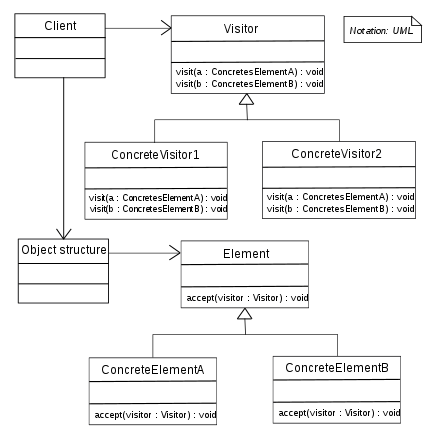

Visitor
=======

تعریف
-----
دیزاین پترن Visitor یک الگوی رفتاری محسوب میشه که اجازه میده الگوریتم ها رو از آبجکت هایی که اون ها رو مدیریت می کنن
جدا کنیم.

این ساختار به ما اجازه میده operation های جدیدی رو به کلاس مورد نظرمون بدون تغییر ساختارش اضافه کنیم.

چه زمانی استفاده میشه؟
----------------------
این الگو رو معمولا زمانی استفاده می کنیم که قصد داریم عملیاتی رو روی تمام المان های یک آبجکت با ساختار پیچیده اجرا کنیم.

همچنین این الگو رو زمانی استفاده می کنیم که یک رفتار مشخص فقط در بعضی کلاس های یک سلسله مراتب معنا میده.

اجزاء
-----
الگوی طراحی Visitor از چند بخش اصلی تشکیل میشه:

اولین قسمت Visitor هست که یک interface یا abstract هست که یک سری متد در اون تعریف میشه که هر کدوم مربوط به یک سری
المان های متفاوت از ساختار آبجکت هستن.

بخش Visitor عملیاتی رو مشخص می کنه که میتونه روی تمام المان های ساختار آبجکت بدون توجه به پیاده سازی اون اعمال بشه.

بخش بعد Concrete Visitor ها هستن که کلاس هایی هستن که Visitor رو پیاده سازی می کنن و و هر کدوم پیاده سازی خاص خودشون
از Visitor رو دارن و میتونن عملیات مورد نظر رو روی المان و داده های اون اجرا کنن.

بخش بعد Element هست که میشه interface یا abstract ای که متد accept در اون تعریف میشه. این متد Visitor رو به عنوان
پارامتر دریافت می کنه و به Visitor اجازه میده به داده های المان دسترسی پیدا کنه و عملیات مورد نظرش رو انجام بده.

بخش بعد هم پیاده سازی های Element ها هستن که هر کدوم پیاده سازی خاصی از accept رو دارن و با توجه به المان مورد نظر،
متد Visitor مناسب رو فراخوانی می کنن.

From Wikipedia, the free encyclopedia

.. caution::
   .. centered:: ✅ مزایای استفاده
   رعایت اصل Open/Closed از اصول Solid

   رعایت اصل تک مسئولیتی

.. warning::
   .. centered:: ❌ معایب استفاده
   بعد از اینکه یک کلاس اضافه یا حذف شد باید تمام visitor ها آپدیت بشن

کاربرد عملی
-----------
این الگو در زبان PHP بسیار کم کاربرد محسوب میشه و سعی می کنم خیلی تمرکز نکنیم روی این الگو یا دیزاین پترن.

اما به هر حال به عنوان نمونه میتونیم یک مثال عملی از این الگو داشته باشیم.

تصور کنید اشکال مختلفی مثل دایره و مربع و مستطیل داریم و قصد داریم مساحت و محیط هر کدوم رو محاسبه کنیم.

میریم سراغ دیزاین پترن Visitor

پیاده سازی
-----------
ساختار ShapeInterface رو ابتدا تعریف می کنیم:

.. literalinclude:: Shape.php
   :language: php
   :linenos:

بعد پیاده سازی های مختلفش رو داریم:

.. literalinclude:: Shapes.php
   :language: php
   :linenos:

بریم سراغ ساختار ShapeVisitorInterface

.. literalinclude:: ShapeVisitorInterface.php
   :language: php
   :linenos:

که به این صورت پیاده سازی میشه:

.. literalinclude:: ShapeVisitor.php
   :language: php
   :linenos:

نحوه فراخوانی
-------------

.. literalinclude:: Call.php
   :language: php
   :linenos:

و تمام!