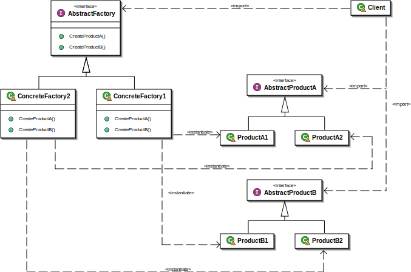

Abstract Factory
================

تعریف
-----
الگوی Abstract Factory یک الگو از نوع الگوهای سازنده یا Creational محسوب میشه که کار اصلی اون ایجاد شی بدون اطلاع سطوح
بالاتر از جزئیات نحوه ایجاد شی هست.

تفاوتی که با الگوی `Factory Method`_ داره اینه که اینجا کلاس Factory ما مجموعه یا خانواده ای از آبجکت های مرتبط رو
تولید می کنه.

اجزاء
-----
الگوی طراحی Abstract Factory از چند بخش اصلی تشکیل میشه:

1.   Abstract Factory: یک کلاس abstract که interface ایجاد مجموعه ای از آبجکت های مرتبط به هم رو مشخص می کنه.

2.   کلاس های concrete که abstract مورد قبل رو پیاده سازی می کنه و مجموعه ای از آبجکت های مرتبط رو ایجاد می کنه.

3.   کلاس های abstract که interface آبجکت های خروجی یا ایجاد شده رو مشخص می کنه.

4.   و در نهایت کلاس های مربوط به آبجکت ایجاد شده که مورد سوم رو پیاده سازی می کنن.

Giacomo Ritucci, CC BY-SA 3.0, via Wikimedia Commons

چه زمانی استفاده میشه؟
----------------------
این الگو زمانی استفاده میشه که قصد داریم مجموعه ای از آبجکت ها از یک خانواده رو تولید کنیم و نمی خوایم سطوح بالاتر
برنامه رو درگیر نحوه ی ایجادشون کنیم.

با این الگو مطمئن میشیم آبجکت های ایجاد شده کاملا با هم مطابقت دارن و از یک خانواده مشابه هستن.

.. image:: categories.png
   :align: center

از وب سایت: refactoring.guru

.. caution::
   .. centered:: ✅ مزایای استفاده
   استفاده از این الگو باعث میشه در سطح بالای برنامه وابستگی به سطوح پایین و انواع پیاده سازی ها از بین بره و
   کلاس های Factory مسئول آماده کردن تنظیمات و سپس ایجاد اشیاء بشن و این مسئولیت رو از روی دوش سطوح بالاتر برنامه بردارن.

.. warning::
   .. centered:: ❌ معایب استفاده
   پیچیده تر شدن برنامه به علت نیاز به تعریف انواع interface و concrete در برنامه

کاربرد عملی
-----------
تصور کنید در حال پیاده سازی یک **فریمورک رابط کاربری** هستیم که قراره از سیستم عامل های مختلف پشتیبانی کنه.

در این شرایط ما یک سری المان های UI داریم که باید برای سیستم عامل های مختلف تعریف بشن.

در واقع یک سری المان یا آبجکت هم خانواده که باید توسط Factory های مربوط به هر سیستم عامل تولید بشن.

پیاده سازی
-----------
ابتدا برای المان های مورد نظرمون که شامل button و checkbox هستن interface تعریف می کنیم:

.. literalinclude:: ElementInterfaces.php
   :language: php
   :linenos:

حالا المان ها رو برای سیستم عامل های مختلف پیاده سازی می کنیم:

.. literalinclude:: Elements.php
   :language: php
   :linenos:

یک interface برای Factory های مورد نظر داریم:

.. literalinclude:: UIFactory.php
   :language: php
   :linenos:

حالا خود Factory ها رو تعریف می کنیم که کارشون برگردوندن المان های مختلف UI هست:

.. literalinclude:: Factories.php
   :language: php
   :linenos:

کد سطح بالای ما در برنامه که از این ساختار و الگو استفاده می کنه به این شکل هست:

.. literalinclude:: Client.php
   :language: php
   :linenos:

نحوه فراخوانی
-------------

.. code-block::  php
   :linenos:

   // Usage
   echo createUI(new WindowsUIFactory()); // Output: Windows style button Windows style checkbox
   echo createUI(new MacOSUIFactory()); // Output: MacOS style button MacOS style checkbox

اینجا دیگه اگر سیستم عامل جدیدی اضافه بشه نیاز به تغییر ساختار کد سطح بالای ما یعنی createUI نیست و فقط کافیه به
عنوان ورودی کلاس سیستم عامل جدید رو بدیم.

و این ما رو یاد چی میندازه؟ درسته Dependency Inversion

برای اطلاعات بیشتر می تونید ویدیوی مربوط به Dependency Inversion رو ببینید:

.. raw:: html

    

        <iframe src="https://www.youtube.com/embed/eCFjTUIbEcg" frameborder="0" allowfullscreen style="position: absolute; top: 0; left: 0; width: 100%; height: 100%;"></iframe>
    

.. _`Factory Method`: https://design-patterns-in-persian.readthedocs.io/en/latest/Creational/StaticFactory/README.html