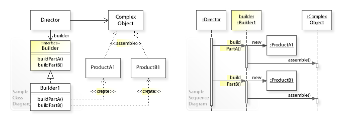

Builder
=======

تعریف
-----
الگوی طراحی Builder، یک الگوی سازنده یا creational هست که به ما اجازه میده آبجکت هایی که فرآیند ایجاد پیچیده ای دارن
رو به صورت مرحله به مرحله تولید کنیم، بدون اینکه این پیچیدگی در سطوح بالاتر برنامه دیده بشه.

اجزاء
-----
الگوی طراحی Builder از چند بخش اصلی تشکیل میشه:

1.   Director: مسئول مدیریت فرآیند خلق آبجکت هست و ارتباط مستقیمی با Builder برقرار می کنه تا مطمئن بشه محصول (آبجکت)
نهایی همون چیزی هست که خواسته شده.

2.   Builder: یک interface برای خلق اجزاء آبجکت پیچیده ی نهایی که شامل متدهای ایجاد هر بخش از محصول نهایی هست.

3.   Concrete Builder: کلاس هایی که Builder رو پیاده سازی می کنن و مراحل خلق آبجکت نهایی رو مشخص می کنن.

4.   Product: آبجکت مورد نظر که قراره بعد از گذر از مراحل مشخص شده در ترکیبی از اجزای مختلف خلق بشه.

4.   Client: بخشی که با ارتباط دادن موارد قبل، ساخت آبجکت از Builder، ارسال اون به Director و فراخوانی متد build منجر
به خلق آبجکت نهایی میشه.

Vanderjoe, CC BY-SA 4.0, via Wikimedia Commons

چه زمانی استفاده میشه؟
----------------------
این الگو زمانی استفاده میشه که خلق آبجکت نهایی مراحل پیچیده ای داشته باشه و شامل چندین قدم باشه و نیاز داریم روی تمام
مراحل کنترل داشته باشیم.

این الگو همچنین به ما اجازه میده نمایش های مختلفی از یک آبجکت داشته باشیم بدون اینکه نیاز باشه سطوح پایین پیاده سازی
رو ویرایش یا modify کنیم. (Open/Closed Principle)

مثلا اگر Builder ما خلق یک خانه هست، این نمایش های مختلف میتونه خانه سنگی، چوبی، آجری و... باشه که متفاوت هستن اما
مراحل خلق مشابهی دارن.

.. caution::
   .. centered:: ✅ مزایای استفاده
   *.   با استفاده از این الگو امکان خلق قدم به قدم آبجکت های پیچیده فراهم میشه

   *.   استفاده مجدد از مراحل مشابه خلق برای نمایش های مختلف

   *.   رعایت اصل Single Responsibility با جداسازی مراحل خلق پیچیده ی آبجکت از ساختار اصلی کد و بخش منطق برنامه

.. warning::
   .. centered:: ❌ معایب استفاده
   پیچیده تر شدن برنامه به علت نیاز به تعریف انواع interface و concrete در برنامه

کاربرد عملی
-----------
فرض کنید محصول نهایی ما یک برگر هست که خروجی نهایی میتونه یک برگر ساده یا یک برگر ویژه باشه!

برای این کار مراحل در هر دو نوع برگر به یک شکل هست اما مراحل تولید برگر پیچیده هست پس اینجا از الگوی طراحی Builder
کمک میگیریم.

پیاده سازی
-----------
ابتدا ساختار کلی Builder رو به این صورت تعریف می کنیم:

.. literalinclude:: BurgerBuilder.php
   :language: php
   :linenos:

حالا دو پیاده سازی مختلف برای برگر معمولی و برگر ویژه داریم:

.. literalinclude:: Builders.php
   :language: php
   :linenos:

و Director که مسئول خلق آبجکت هست:

.. literalinclude:: BurgerDirector.php
   :language: php
   :linenos:

حالا بخش Product رو تعریف می کنیم که میشه آبجکت نهایی که باید برگرده:

.. literalinclude:: Burger.php
   :language: php
   :linenos:

و در نهایت هم Client رو داریم:

.. literalinclude:: Client.php
   :language: php
   :linenos:

نحوه فراخوانی
-------------

.. code-block::  php
   :linenos:

   clientCode();

به همین زیبایی!
