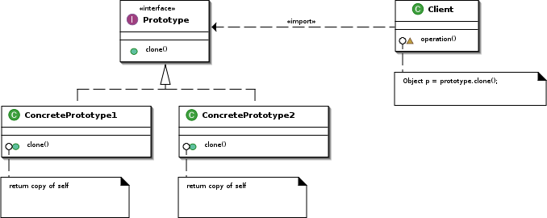

Prototype
=========

تعریف
-----
الگوی طراحی Prototype، یک الگوی سازنده یا creational محسوب میشه که به شما اجازه میده از آبجکت های موجود کپی ایجاد
کنید بدون اینکه سطوح بالای برنامه رو درگیر جزئیات فرآیند کپی بکنید.

در واقع قراره به جای اینکه آبجکت های جدید رو از روش معمول استفاده از کلمه کلیدی new ایجاد کنیم و بعد تک تک property ها
و method ها رو منتقل کنیم به آبجکت جدید، از روش بهتری استفاده کنیم!

اجزاء
-----
الگوی طراحی Prototype از چند بخش اصلی تشکیل میشه:

1.   Prototype interface/abstract class: مشخص کننده متدهای معمول که توسط concrete ها باید پیاده سازی بشن. (شامل متد
clone که مسئول ایجاد کپی از آبجکت مورد نظر هست)

2.   Concrete prototypes: مشخص کننده ساختار و فرآیند دقیق کپی شدن آبجکت.

3.   Client: بخشی از کد که از Prototype ها برای ایجاد کپی استفاده می کنه. در واقع کارش اینه که از Prototype Manager
یک Prototype دریافت می کنه و از اون برای ایجاد کپی آبجکت مورد نظر استفاده می کنه.

4.   Prototype manager: یک بخش اختیاری که مسئولیتش مدیریت Prototype های مختلف و تحویل دادن Prototype مناسب هست.

User:Giacomo Ritucci, CC BY-SA 3.0, via Wikimedia Commons

چه زمانی استفاده میشه؟
----------------------
این الگو رو زمانی استفاده می کنیم که از یک آبجکت تعدادی کپی نیاز داریم و میدونیم که فرآیند نسبتا پیچیده ای برای انجام
این کپی و انتقال property و method ها نیاز هست.

با استفاده از این الگو این پیچیدگی رو از بدنه ی کد مربوط به قسمت های سطح بالای برنامه جدا می کنیم.

.. caution::
   .. centered:: ✅ مزایای استفاده
   *.   جداسازی فرآیند کپی آبجکت از منطق برنامه

   *.   ایجاد ساده تر آبجکت های جدید

   *.   جلوگیری از نوشته شدن کدهای زیاد تکرارشونده برای ایجاد اشیاء

.. warning::
   .. centered:: ❌ معایب استفاده
   کپی کردن آبجکت های شامل مرجع های circular ممکنه باعث بروز خطا بشه

کاربرد عملی
-----------
فرض کنید برنامه ای داریم که یک سری کتاب رو تولید می کنه و این کتاب ها میتونن عناوین متنوعی داشته باشن.

چکار کنیم که مجبور نباشیم برای هر کتاب از ابتدا یک آبجکت جدید ایجاد کنیم؟

پیاده سازی
-----------
ابتدا ساختار کلی Prototype رو مشخص می کنیم:

.. literalinclude:: BookPrototype.php
   :language: php
   :linenos:

حالا دو پیاده سازی مختلف برای این Prototype در نظر میگیریم:

.. literalinclude:: Prototypes.php
   :language: php
   :linenos:

نحوه فراخوانی
-------------

.. literalinclude:: Call.php
   :language: php
   :linenos:

و تمام!