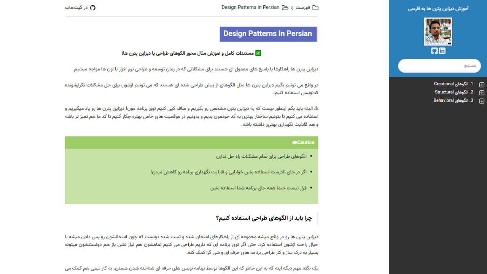

# Design Patterns In Persian

آموزش الگوهای طراحی یا دیزاین پترن ها به زبان فارسی

[مطالعه آموزش](https://design-patterns-in-persian.readthedocs.io/en/latest/) یا [دانلود آموزش](https://readthedocs.org/projects/design-patterns-in-persian/downloads/) از طریق وب سایت Read The Docs

آموزش کامل مثال محور الگوهای طراحی به زبان فارسی همراه با مثال های عملی از زبان PHP8

## الگوها

الگوهای طراحی رو میشه از لحاظ هدفی که دنبال می کنن به چند دسته تقسیم کرد که هر کدوم رو به صورت مجزا بررسی خواهیم کرد:

### [Creational](https://design-patterns-in-persian.readthedocs.io/en/latest/Creational/README.html)

* [Static Factory 📑](https://design-patterns-in-persian.readthedocs.io/en/latest/Creational/StaticFactory/README.html)
* [Simple Factory 📑](https://design-patterns-in-persian.readthedocs.io/en/latest/Creational/SimpleFactory/README.html)
* [Factory Method 📑](https://design-patterns-in-persian.readthedocs.io/en/latest/Creational/FactoryMethod/README.html)
* [Abstract Factory 📑](https://design-patterns-in-persian.readthedocs.io/en/latest/Creational/AbstractFactory/README.html)
* [Builder 📑](https://design-patterns-in-persian.readthedocs.io/en/latest/Creational/Builder/README.html)
* [Prototype 📑](https://design-patterns-in-persian.readthedocs.io/en/latest/Creational/Prototype/README.html)
* [Singleton 📑](https://design-patterns-in-persian.readthedocs.io/en/latest/Creational/Singleton/README.html)

### [Structural](https://design-patterns-in-persian.readthedocs.io/en/latest/Structural/README.html)

* [Adapter 📑](https://design-patterns-in-persian.readthedocs.io/en/latest/Structural/Adapter/README.html)
* [Bridge 📑](https://design-patterns-in-persian.readthedocs.io/en/latest/Structural/Bridge/README.html)
* [Composite 📑](https://design-patterns-in-persian.readthedocs.io/en/latest/Structural/Composite/README.html)
* [DataMapper 📑](https://design-patterns-in-persian.readthedocs.io/en/latest/Structural/DataMapper/README.html)
* [Decorator 📑](https://design-patterns-in-persian.readthedocs.io/en/latest/Structural/Decorator/README.html)
* [Facade 📑](https://design-patterns-in-persian.readthedocs.io/en/latest/Structural/Facade/README.html)
* [Flyweight 📑](https://design-patterns-in-persian.readthedocs.io/en/latest/Structural/Flyweight/README.html)
* [Proxy 📑](https://design-patterns-in-persian.readthedocs.io/en/latest/Structural/Proxy/README.html)

### [Behavioral](https://design-patterns-in-persian.readthedocs.io/en/latest/Behavioral/README.html)

* [Chain of Responsibility 📑](https://design-patterns-in-persian.readthedocs.io/en/latest/Behavioral/ChainOfResponsibility/README.html)
* [Command 📑](https://design-patterns-in-persian.readthedocs.io/en/latest/Behavioral/Command/README.html)
* [Iterator 📑](https://design-patterns-in-persian.readthedocs.io/en/latest/Behavioral/Iterator/README.html)
* [Mediator 📑](https://design-patterns-in-persian.readthedocs.io/en/latest/Behavioral/Mediator/README.html)
* [Memento 📑](https://design-patterns-in-persian.readthedocs.io/en/latest/Behavioral/Memento/README.html)

## چطور به این پروژه کمک کنیم؟ 

- با ⭐ دادن به پروژه و ارسالش برای دوستانتون باعث بیشتر دیده شدنش بشید
- این پروژه رو میتونید fork کنید و زبان ها و اشکال دیگه گسترشش بدید
- توی یوتیوب [ویدیوهای مربوط](https://www.youtube.com/playlist?list=PLwQhn2KOvsfVku8Dh8adeQj6s1qNIk42v) 📽 رو ببینید 
  و کانال رو سابسکرایب و ویدیو ها رو لایک ♥ و با بقیه به اشتراک بگذارید
- در پروژه contribution داشته باشید
