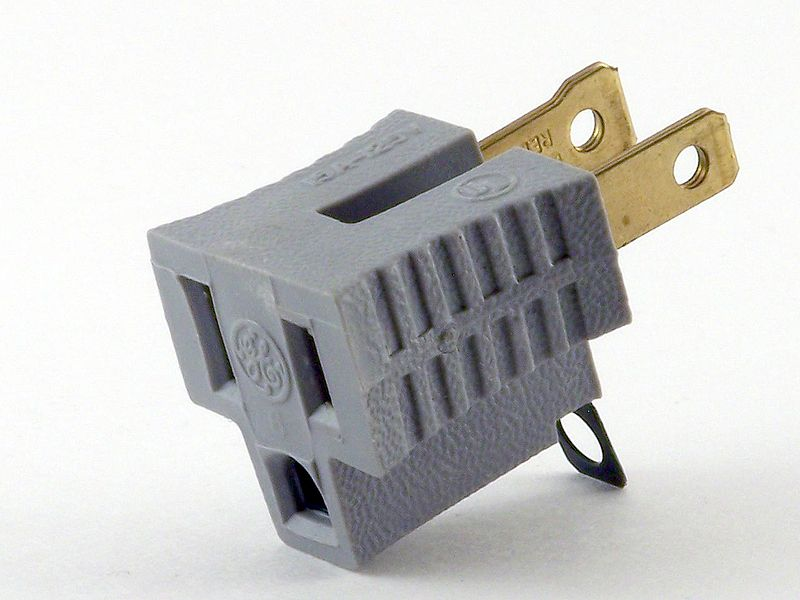

Adapter
=======

تعریف
-----
یکی از معروف ترین مثال هایی که برای الگوی طراحی Adapter یا Wrapper وجود داره خود آداپتور هست! مثلا آداپتور های 3 به 2
که پریز برق سه
شاخه رو به دو شاخه تبدیل می کنن.

Standderivative work: PleaseStand, CC BY 3.0, via Wikimedia Commons

در واقع در چنین حالتی نه سه شاخه تغییری کرده و نه ورودی دو شاخه ی روی دیوار، بلکه این وسط ما یک پل ارتباطی اضافه
کردیم که نقش آداپته کننده یا مطابقت دهنده رو بازی می کنه.

در الگوی طراحی Adapter هم دقیقا چنین اتفاقی رخ میده و این الگو قرار هست به صورت یک سازگار کننده بین interface های
مختلف عمل کنه و فراخوانی ها رو از یک interface به interface دوم ترجمه کنه.

این موضوع باعث میشه client بتونه با کلاس آداپته شده دقیقا مثل کلاس اصلی ارتباط برقرار کنه بدون اینکه متوجه تفاوت بشه.

اجزاء
-----
الگوی طراحی Adapter از چند بخش اصلی تشکیل میشه:

1.   Target Interface: مشخص کننده ی interface ای که client برای ارتباط با adapter از آن استفاده می کند.

2.   Adaptee: کلاسی که می بایست آداپته شود.

3.   Adapter:کلاسی که interface مربوط به Adaptee را با Target Interface هماهنگ می کند.

4.   Client: کلاسی که از طریق Target Interface با آداپتور ارتباط برقرار می کند بدون اینکه از حضور Adaptee اطلاعی
داشته باشد.

Trashtoy, Public domain, via Wikimedia Commons

چه زمانی استفاده میشه؟
----------------------
این الگو رو همونطور که توضیح دادم زمانی استفاده می کنیم که نیاز باشه در برنامه راهی پیدا کنیم برای هماهنگ کردن کلاس
های ناهماهنگ با همدیگه.

.. caution::
   .. centered:: ✅ مزایای استفاده
    رعایت اصل تک مسئولیتی از اصول Solid

   رعایت اصل Open/Closed از اصول Solid با هماهنگ کردن کلاس های جدید با ساختار فعلی بدون تغییر ساختار کد

   جلوگیری از نوشته شدن کدهای زیاد تکرارشونده برای ایجاد اشیاء

.. warning::
   .. centered:: ❌ معایب استفاده
   به علت افزایش تعداد کلاس ها و interface پیچیدگی برنامه قطعا افزایش پیدا می کنه

کاربرد عملی
-----------
فرض کنید یک سیستم پرداخت داریم که داره از interface به نام Payment با یک متد processPayment استفاده می کنیم.

حالا یک کلاس یا پکیج جدید به ما داده میشه که در برنامه مون استفاده کنیم بدون اینکه ساختار کلاس رو عوض کنیم.

اینجاست که الگوی Adapter وارد عمل میشه.

پیاده سازی
-----------
ساختار interface ای که برنامه در حال حاضر داره ازش استفاده می کنه:

.. literalinclude:: Payment.php
   :language: php
   :linenos:

و کلاسی که در اختیار ما قرار گرفته و با این interface هماهنگ نیست:

.. literalinclude:: PaymentGateway.php
   :language: php
   :linenos:

اینجاست که با کلاس Adapter میایم تا این هماهنگی رو انجام بدیم:

.. literalinclude:: PaymentGatewayAdapter.php
   :language: php
   :linenos:

کلاسی که یک آبجکت از نوع Payment رو دریافت می کرد و پردازش پرداخت رو انجام میداد حالا امکان دریافت آبجکت از نوع کلاس
جدید رو هم پیدا می کنه:

.. literalinclude:: PaymentProcessor.php
   :language: php
   :linenos:

نحوه فراخوانی
-------------

.. literalinclude:: Call.php
   :language: php
   :linenos:

اصل Open/Closed میبینید که اینجا به خوبی داره رعایت میشه.

آموزش ویدیویی
-------------

.. raw:: html

    

        <iframe src="https://www.youtube.com/embed/YiUcdswfG00" frameborder="0" allowfullscreen style="position: absolute; top: 0; left: 0; width: 100%; height: 100%;"></iframe>
    

