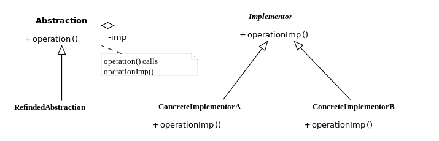

Bridge
======

تعریف
-----
دیزاین پترن Bridge یک الگوی طراحی ساختاری محسوب میشه که بر مبنای ایده ترجیح **ترکیب به جای ارث بری** بنا شده.

در واقع میشه گفت این دیزاین پترن به شما اجازه میده یک کلاس بزرگ یا مجموعه ای از کلاس های مرتبط با هم رو به دو سلسله
مراتب مجزا یعنی انتزاع یا abstraction و پیاده سازی تقسیم کنید.

این الگو بیشتر زمانی مورد استفاده قرار میگیره که قراره برنامه ما از چند سیستم عامل یا چند زبان پشتیبانی کنه.

به نظرتون پیچیده میاد؟

نگران نباشید، ادامه آموزش رو که بخونید کاملا متوجه مفهومش میشید.

اجزاء
-----
الگوی طراحی Bridge از چند بخش اصلی تشکیل میشه:

1.   Abstraction: یک interface سطح بالا محسوب میشه که client با ارتباط با اون میتونه با سیستم مد نظر در ارتباط باشه.

2.   Implementation: شامل interface سطح پایین که تعریف می کنه عملیات abstraction چطور باید اتفاق بیفته، همچنین باید
گونه ای  پیاده سازی بشه که مستقل از جزئیات abstraction باشه.

Radowod, CC BY-SA 3.0, via Wikimedia Commons

چه زمانی استفاده میشه؟
----------------------
این دیزاین پترن رو زمانی استفاده می کنیم که قصد تقسیم و سازمان دهی یک کلاس یکپارچه شامل چند گونه از چند عملکرد رو
داشته باشیم.

مثلا زمانی که یک کلاس امکان کار با چند دیتابیس یا سیستم عامل مختلف رو داشته باشه و نخوایم مثلا به ازای 3 سیستم عامل
مختلف برای 4 کلاس مختلف، 3 ضربدر 4، یعنی 12 کلاس با نام های مختلف مختلف بسازیم!

و همچنین زمانی مورد استفاده قرار میگیره که بخوایم یک کلاس موجود رو در چند سطح مختلف (و مستقل) گسترش بدیم.

.. caution::
   .. centered:: ✅ مزایای استفاده
   امکان ایجاد برنامه ها و کلاس های مستقل از پلتفرم اجرایی، یا چند بستری

   رعایت اصول Open/Closed و تک مسئولیتی از اصول Solid با ایجاد امکان گسترش abstraction ها و implementation ها به صورت مستقل از همدیگر

.. warning::
   .. centered:: ❌ معایب استفاده
   به علت افزایش تعداد کلاس ها و... پیچیدگی برنامه قطعا افزایش پیدا می کنه

کاربرد عملی
-----------
خب فرض کنید یک صفحه وب داریم که دو تم Light و Dark داره. (یا حتی بیشتر)

برای پیاده سازی اون میتونیم از دیزاین پترن Bridge استفاده کنیم.

پیاده سازی
-----------
خب قبل از هر چیز مربوط به تم رو داریم:

.. literalinclude:: Theme.php
   :language: php
   :linenos:

و بعد هم پیاده سازی های مربوط به تم تیره و روشن:

.. literalinclude:: Themes.php
   :language: php
   :linenos:

خب حالا میریم سراغ interface به نام WebPage که به این صورت تعریف میشه:

.. literalinclude:: WebPage.php
   :language: php
   :linenos:

و کلاس AbstractWebPage که WebPage رو پیاده سازی می کنه:

.. literalinclude:: AbstractWebPage.php
   :language: php
   :linenos:

و در نهایت میتونیم برای صفحات مختلف به این شکل عمل کنیم:

.. literalinclude:: AbstractWebPages.php
   :language: php
   :linenos:

نحوه فراخوانی
-------------

.. literalinclude:: Call.php
   :language: php
   :linenos:

میبینید که اینجا دیگه لازم نیست ما به ازای هر نوع تم یک کلاس مجزا مثل DarkThemeHomePage و LightThemeHomePage داشته
باشیم و با استفاده از الگوی طراحی Bridge تونستیم این مسئله رو به این شکل حل کنیم.