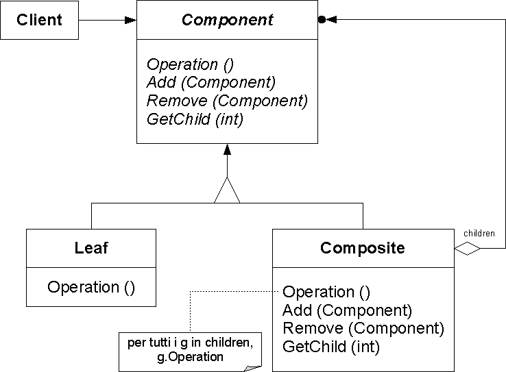

Composite
=========

تعریف
-----
دیزاین پترن Composite یک الگوی ساختاری محسوب میشه که به شما اجازه میده آبجکت ها رو در ساختارهای درختی با هم ترکیب
کنید و با این ساختار ها به گونه ای کار کنید که گویا آبجکت های مستقل از هم هستند.

این الگو بر مبنای برخورد یکسان با آبجکت های مستقل و ترکیبی از آبجکت ها بنا شده.

اجزاء
-----
الگوی طراحی Composite از چند بخش اصلی تشکیل میشه:

1.   Component: یک interface کلی که تمام آبجکت های حاضر در ترکیب سلسله مراتب اون رو پیاده سازی می کنن.

2.   Leaf: عضو پایه ای تشکیل دهنده ترکیب سلسله مراتب که امکان داشتن فرزند رو نداره و Component رو پیاده سازی می کنه و
نمایش دهنده ی آبجکت های مستقل موجود در ترکیب هست.

3.   Composite: این آبجکتی هست که آبجکت های Leaf رو به عنوان فرزندان خودش داره، Component رو پیاده سازی می کنه و
behavior فرزندانش رو تعریف می کنه. همچنین میتونه متدهای اضافه ای داشته باشه برای manipulate فرزندان.

NGiacomo Ritucci CC BY-SA 3.0, via Wikimedia Commons

برای اینکه این اجزاء رو بهتر درک کنید فرض کنید یک سیستم Ordering داریم که تشکیل شده از یک سری محصول و جعبه.

در بالاترین سطح این سلسله مراتب ما Order رو داریم و در سطوح پایین تر جعبه (Composite) و همینطور در سطوح آخر محصول
(Leaf) رو داریم.

چه زمانی استفاده میشه؟
----------------------
این الگو رو زمانی استفاده می کنیم که مطمئن بشیم امکان ایجاد و تصویر یک ساختار درختی سلسله مراتبی در برنامه و هسته ی
اون وجود داره.

اولین چیزی که میتونیم تصویر کنیم ساختار DOM یک فایل HTML هست.

.. caution::
   .. centered:: ✅ مزایای استفاده
   امکان کار ساده تر با ساختارهای درختی پیچیده

   رعایت اصل Open/Closed به علت عدم تغییر ماهیت و ساختار کد با اضافه شدن المان ها به ساختار درختی

.. warning::
   .. centered:: ❌ معایب استفاده
   تعریف یک interface واحد برای کلاس هایی که عملکرد متفاوتی دارن معمولا کار سختی هست

کاربرد عملی
-----------
تصور کنید یک شرکت داریم که هم محصولات فیزیکی ارائه می کنه و هم محصولات دیجیتال.

محصولات فیزیکی می تونن کتاب و گجت باشن و محصولات دیجیتال میتونن فیلم یا موسیقی باشن.

به نظر میرسه چون با یک ساختار درختی مواجه هستیم می تونیم از دیزاین پترن Composite استفاده کنیم.

پیاده سازی
-----------
ابتدا میریم سراغ Component که شامل یک interface برای تعریف متدها و پراپرتی های مشترک هست:

.. literalinclude:: Product.php
   :language: php
   :linenos:

هر محصول شامل نام و قیمت هست.

بعد از این کلاس Composite رو تعریف می کنیم که اینجا کاتالوگ محصولات نام داره و میتونه شامل آرایه ای از محصولات باشه
ولی در عین حال interface بالا رو هم پیاده سازی می کنه:

.. literalinclude:: Composite.php
   :language: php
   :linenos:

نامش که مشخصه ولی قیمتش میشه شامل مجموع قیمت محصولاتی که در کاتالوگ وجود داره.

و بعد هم که تعریف Leaf یا لایه های آخر این سلسله مراتب رو داریم که میشه همون انواع محصولات واقعی که سیستم ما ارائه می
کنه:

.. literalinclude:: Leaf.php
   :language: php
   :linenos:

نحوه فراخوانی
-------------

.. literalinclude:: Call.php
   :language: php
   :linenos:

در اینجا یک کاتالوگ از محصولات مورد نظرمون درست می کنیم و در نهایت نام کاتالوگ و قیمت محصولات موجود در کاتالوگ رو در
خروجی نمایش میدیم.