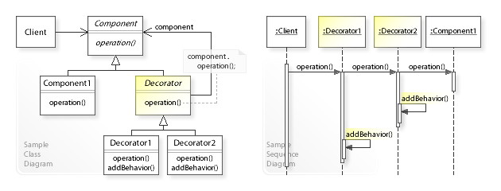

Decorator
=========

تعریف
-----
دیزاین پترن Decorator یک الگوی ساختاری محسوب میشه که به ما اجازه میده بدون تغییر یک آبجکت بتونیم بهش عملکرد جدید
اضافه کنیم و یک جایگزین برای استراتژی ایجاد زیر کلاس برای گسترش عملکرد محسوب میشه.

در واقع یک کلاس Decorator خواهیم داشت که کلاس اصلی رو در بر میگیره (wrapping) و عملکرد های جدیدی رو بهش اضافه می کنه.

نکته مهم اینجا اینه که کلاس Decorator و کلاس پایه ی ما هر دو یک interface رو پیاده سازی می کنن و همین باعث میشه که
امکان جایگزینیشون فراهم بشه.

کلاس Decorator همچنین یک ارجاع به کلاس اصلی رو هم در خودش نگهداری می کنه.

اجزاء
-----
برای مشخص کردن اجزاء مختلف باید ابتدا مطمئن بشید که برنامه شما میتونه در قالب یک **Main Component** با چند لایه
(اختیاری) که اون رو wrap کرده در بیاد.

بعد بررسی می کنیم که چه متدهایی بین کامپوننت اصلی و لایه های اختیاری مشترک هستن که بتونیم **Component Interface** رو
تشکیل بدیم.

حالا یک **Concrete Component** ایجاد می کنیم و behavior پایه اون رو مشخص می کنیم.

حالا کلاس **Base Decorator** رو ایجاد می کنیم که شامل یک فیلد برای نگهداری ارجاع به آبجکت Wrapped هست. نوع این فیلد هم
باید از نوع interface ای که ابتدا تعریف کردیم یعنی Component Interface باشه.

و حالا **Concrete Decoration** ها رو با extend کردن از Base Decorator ایجاد می کنیم.

و بعد هم که طبق معمول **Client Code** وارد میدان میشه و با استفاده از مواردی که نیاز برنامه هست از این ترکیب استفاده
می کنه.

Vanderjoe, CC BY-SA 4.0, via Wikimedia Commons

چه زمانی استفاده میشه؟
----------------------
این الگو رو زمانی استفاده می کنیم که مطمئن بشیم میشه برنامه رو در قالب یک بخش اصلی و یک سری لایه های اختیاری که اون
رو wrap می کنن تعریف کنیم.

.. caution::
   .. centered:: ✅ مزایای استفاده
   امکان افزودن عملکرد و قابلیت های جدید به یک آبجکت موجود به صورت داینامیک بدون تغییر ساختار اصلی و افزودن زیرکلاس

   رعایت اصول Open/Closed و تک مسئولیتی به علت عدم تغییر ماهیت و ساختار کد در زمان افزودن امکانات و قابلیت های جدید و جدا نگهداشتن کلاس اصلی و قابلیت های افزوده شده در کلاس های Decorator مجزای جدید و در نتیجه افزایش قابلیت نگهداری برنامه

   امکان ترکیب چندین عملکرد و رفتار با wrap کردن یک آبجکت در چندین Decorator مختلف

.. warning::
   .. centered:: ❌ معایب استفاده
   پیچیدگی های موجود در برای حذف و افزودن wrapper ها و همچنین پیچیده به نظر رسیدن کد

کاربرد عملی
-----------
خب تصور کنید که یک سیستم ارسال ناتیفیکیشن پایه داریم که قصد داریم به شکل های مختلف اون رو گسترش بدیم، مثلا ارسال توسط
روش های مختلف ایمیل و SMS و...

اینجاست که یاد دیزاین پترن Decorator میفتیم.

پیاده سازی
-----------
قبل از هر چیز یک interface مشترک داریم که کارش ارسال ناتیفیکیشن هست.

.. literalinclude:: Notification.php
   :language: php
   :linenos:

کلاس پایه ای که قصد گسترشش توسط دیزاین پترن Decorator رو داریم به این شکل تعریف شده و به شکل ساده ای پیام رو ارسال می
کنه.

.. literalinclude:: ConcreteNotification.php
   :language: php
   :linenos:

بعد از این ما یک کلاس پایه ی Decorator داریم که همون کلاس اصلی Notification رو پیاده سازی می کنه و هدف اصلیش مشخص
کردن یک الگوی مشخص برای Decorator هایی هست که از این به بعد برای کلاس پایه تعریف میشن. و معمولا شامل یک ارجاع به کلاس
پایه یعنی ConcreteNotification هست.

.. literalinclude:: NotificationDecorator.php
   :language: php
   :linenos:

بعد از این کلاس های Concrete مربوط به Decorator رو داریم که روش های مختلف Decorate شدن کلاس پایه رو مشخص می کنن.

مثلا ارسال با SMS و ارسال با Email

.. literalinclude:: Decorators.php
   :language: php
   :linenos:

توجه کنید که Decorator ها میتونن پیاده سازی Parent رو به این شکل در متد تغییر یافته فراخوانی کنن.

این فراخوانی می تونه قبل یا بعد از فراخوانی آبجکت wrap شده باشه.

نحوه فراخوانی
-------------

.. literalinclude:: Call.php
   :language: php
   :linenos:

همونطور که میبینید متد clientCode اینجا هم میتونه از نوع پایه ورودی بگیره هم از نوع Decorator و هم از ترکیبی از
Decorator ها