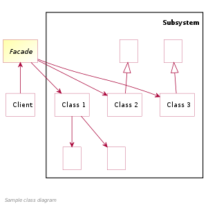

Facade
======

تعریف
-----
دیزاین پترن Facade یک الگوی ساختاری محسوب میشه که به ما اجازه میده یک interface ساده برای یک سیستم پیچیده فراهم کنیم.

با این کار لایه های پیچیده ی برنامه رو از دید سطوح بالاتر پنهان می کنیم و اجازه میدیم خیلی راحت تر بشه با برنامه در
ارتباط بود.

این الگوی طراحی یکی از پراستفاده ترین الگو ها در فریمورک های مختلف محسوب میشه.

اجزاء
-----
یک دیزاین پترن Facade از دو بخشی اصلی به اضافه **Client** تشکیل میشه.

مهم ترین بخش که سیستم نهایی سطح بالا با اون سر و کار داره **بخش Facade** هست که شامل یک interface ساده برای کار کردن با
بخش های مختلف سیستم پیچیده یا زیر سیستم ها **(Subsystems)** محسوب میشه.

زیر سیستم ها component های مستقل سیستم هستن که هر کدوم وظایف مشخصی دارن و تلاش ما اینه که پیچیدگی این زیر سیستم ها رو
از دید لایه سطح بالای برنامه پنهان کنیم.

Original Vanderjoe Vector:  FeRDNYC, CC BY-SA 4.0, via Wikimedia Commons

چه زمانی استفاده میشه؟
----------------------
این الگو رو زمانی استفاده می کنیم که با یک سیستم نسبتا پیچیده طرف هستیم که قرار نیست سطوح بالای برنامه اطلاعی از این
پیچیدگی داشته باشن، پس در این شرایط سعی می کنیم روش ساده تری برای دسترسی سطوح بالا به عملکرد های مختلف این سیستم
فراهم کنیم.

.. caution::
   .. centered:: ✅ مزایای استفاده
   حذف پیچیدگی برنامه برای سطوح بالاتر برنامه

.. warning::
   .. centered:: ❌ معایب استفاده
   یک Facade ممکنه تبدیل به یک آبجکت خیلی بزرگ با قابلیت های خیلی زیاد بشه که به تعداد زیادی کلاس متصله (God Object)

کاربرد عملی
-----------
تصور کنید یک سری کلاس داریم که هر کدوم مربوط به بخشی از عملیات پرداخت هستن و قرار نیست سطوح بالا رو درگیر کار با تمام
این کلاس ها کنیم.

اینجاست که استفاده از دیزاین پترن Facade میتونه مفید باشه.

پیاده سازی
-----------
زیر سیستم های ما شامل کلاس های زیر هستن:

.. literalinclude:: Subsystems.php
   :language: php
   :linenos:

که مراحل مختلف پرداخت رو مدیریت می کنن.

و کلاس Facade رو به این صورت تعریف می کنیم:

.. literalinclude:: OrderFacade.php
   :language: php
   :linenos:

پس این کلاس Facade هست که با این پیچیدگی مواجه میشه و اون رو در نهایت تبدیل به یک متد به نام placeOrder می کنه.

نحوه فراخوانی
-------------

.. literalinclude:: Call.php
   :language: php
   :linenos:

و کد سطح بالای ما در نهایت فقط از ساختار Facade اطلاع داره و از لایه های زیرین برنامه یعنی زیر سیستم ها مطلع نمیشه.