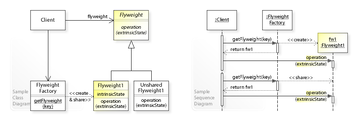

Flyweight
=========

تعریف
-----
دیزاین پترن Flyweight که یک الگوی ساختاری محسوب می شود در شرایطی استفاده می شود که قصد داشته باشیم میزان مصرف حافظه
رم را بهینه سازی کنیم.

اما چطور؟ به جای نگهداری تمام داده ها در هر آبجکت، بخش های مشترک آبجکت ها را بین آبجکت های مورد نظر به اشتراک میذاریم.

اجزاء
-----
یک دیزاین پترن Flyweight از چند بخشی اصلی تشکیل میشه.

ابتدا بررسی می کنیم که قسمت های مشترک چه مواردی هستن و با توجه به این موضوع خود **Flyweight** مشخص میشه که شامل بخشی
هست  که مشخص می کنه متدها و پراپرتی های مشترک چه مواردی هستن. و در نهایت بخش Client، از اون برای دسترسی به قسمت های
مشترک استفاده میکنه.

بعد از اون **پیاده سازی های Flyweight** رو داریم که در واقع همون آبجکت پیاده سازی شده ی بخش های مشترک هست و اینترفیس
Flyweight رو پیاده سازی می کنه.

بخش بعد **Flyweight Factory** هست که کارش مدیریت ایجاد و به اشتراک گذاری آبجکت های Flyweight هست. یک pool شامل آبجکت
های
Flyweight موجود رو نگهداری می کنه و آبجکت رو اگر موجود باشه برمیگردونه و اگر نباشه ایجاد می کنه.

و در نهایت هم بخش **Client** رو داریم که در مثال عملی خواهید دید کارش چیه.

Vanderjoe, CC BY-SA 4.0, via Wikimedia Commons

چه زمانی استفاده میشه؟
----------------------
این الگو معمولا در طراحی بازی های کامپیوتری برای کاهش رم مصرفی بسیار استفاده میشه و در نهایت کاری که انجام میده همیشه
کاهش میزان رم مصرفی هست.

توصیه میشه که این الگو رو فقط زمانی استفاده کنید که برنامه شما مشکلات مربوط به مصرف بالای رم رو داشته باشه، برنامه هایی که تعداد بسیار زیادی آبجکت با اطلاعات داده ای مشترک دارن و هر کدوم بخشی از رم رو اشغال می کنن.

.. caution::
   .. centered:: ✅ مزایای استفاده
   بهینه سازی بالای مصرف رم برنامه زمانی که تعداد آبجکت های مشابه زیادی در برنامه وجود داره.

.. warning::
   .. centered:: ❌ معایب استفاده
   ممکنه با کاهش رم مصرفی به علت اجبار در محاسبه ی مجدد برخی موارد، مصرف CPU افزایش پیدا کنه!

   کد بسیار پیچیده میشه و معمولا خواناییش کاهش پیدا می کنه!

کاربرد عملی
-----------
این الگو در برنامه نویسی با PHP بسیار بسیار کم کاربرد هست اما برای اینکه ساختارش رو درک کنید سعی می کنم یه مثال براش
پیدا کنم!

قطعا کسی با PHP بازی طراحی نمی کنه ولی خب این ملموس ترین مثالیه که میشه داشت.

فرض کنید در حال کدنویسی یک بازی کامپیوتری هستیم که تعداد خیلی زیادی کاراکتر داره که هر کدوم هم توانایی ها و ظاهر
مخصوص به خودشون رو دارن.

با این حال جنبه های ظاهری زیادی از این کاراکتر ها مشابه هست و میشه اون ها رو به صورت مشترک نگهداری کرد.

پیاده سازی
-----------
خب ابتدا خود Flyweight رو داریم:

.. literalinclude:: Flyweight.php
   :language: php
   :linenos:

موارد مشابه بین کاراکتر های مختلف:

.. literalinclude:: OrderFacade.php
   :language: php
   :linenos:

نوبت به Factory میرسه که به این صورت تعریف میشه:

موارد مشابه بین کاراکتر های مختلف:

.. literalinclude:: Factory.php
   :language: php
   :linenos:

که بالاتر در مورد نحوه ی عملکردش توضیح دادیم.

و حالا CharacterClient رو داریم:

.. literalinclude:: CharacterClient.php
   :language: php
   :linenos:

نحوه فراخوانی
-------------

.. literalinclude:: Call.php
   :language: php
   :linenos:

اینجا factory برای ما فقط دو آبجکت کاراکتر میسازه و موارد مشترک رو مجدد نمیسازه.