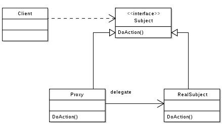

Proxy
=====

تعریف
-----
دیزاین پترن Proxy یک الگوی طراحی ساختاری محسوب میشه که به شما اجازه میده یک جانشین برای آبجکت مورد نظرتون ایجاد کنید.

در واقع میشه گفت پراکسی، با قرار گرفتن بین آبجکت اصلی و Client، نحوه دسترسی به آبجکت اصلی رو کنترل می کنه و اجازه
میده اتفاقاتی قبل و بعد از دسترسی به آبجکت مورد نظر رخ بده.

چه زمانی استفاده میشه؟
----------------------
این الگو میتونه در موارد مختلفی استفاده بشه.

به عنوان مثال میتونه برای Lazy initialization یا Virtual Proxy استفاده بشه.

در واقع زمانی که یک سرویس سنگین داریم که منابع زیادی در سیستم مصرف می کنه اما نیاز نیست همیشه در دسترس باشه میتونیم
با استفاده از این الگو، initialize کردن آبجکت رو تا زمانی که واقعا بهش نیاز هست به تاخیر بندازیم.

یا میتونه به عنوان پراکسی حفاظتی یا Protection استفاده بشه و اجازه دسترسی کاربر رو قبل از دسترسی به آبجکت مورد نظر چک
کنه.

همچنین در کاربرد های متنوع دیگه ای مثل log کردن درخواست قبل از اجرا، کش کردن اطلاعات و استفاده از کش به جای نمایش
داده اصلی و... استفاده میشه.

کلا خیلی الگوی پرکاربردی محسوب میشه!

اجزاء
-----
یک دیزاین پترن Proxy از چند بخشی اصلی تشکیل میشه.

قبل از هر چیز یک کلاس اصلی داریم که قرار هست پراکسی باهاش در ارتباط باشه که **RealSubject** نام داره.

بعد از اون **Subject** رو داریم که در واقع interface مشترک بین RealSubject و Proxy هست و عملکرد اصلی برنامه رو مشخص می
کنه.

مشخصا **Proxy** رو داریم که قرار هست به عنوان جایگزینی برای کلاس اصلی یا همون RealSubject توسط Client مورد استفاده قرار
بگیره.

پراکسی در این بین ممکنه عملیات مختلفی رو قبل از دسترسی به کلاس اصلی انجام بده، مواردی مثل بهینه سازی، کش کردن، بررسی
بحث های سطوح دسترسی و...

و در نهایت هم که مثل همیشه **Client** رو داریم.

Traced by User:Stannered, created by en:User:TravisHein, CC BY-SA 3.0, via Wikimedia Commons

.. caution::
   .. centered:: ✅ مزایای استفاده
   امکان اعمال کنترل روی سرویس مورد نظر بدون اینکه client از نحوه ی اعمال آن با خبر باشد

   پراکسی میتونه بدون در دسترس بودن سرویس اصلی به کار خودش ادامه بده!

   اصل Open/Closed به علت امکان تعریف پراکسی های جدید بدون تغییر سرویس رعایت میشه

.. warning::
   .. centered:: ❌ معایب استفاده
   ممکنه سرعت دسترسی به سرویس کمی کاهش پیدا کنه

   به علت احتمال تعریف تعداد زیادی کلاس جدید، کد پیچیده تر خواهد شد

کاربرد عملی
-----------
خب این الگوی طراحی کاربردهای متنوعی داره که بالاتر هم بهشون اشاره شد.

ما یکی از کاربردهای اون که کش کردن هست رو سعی می کنیم پیاده سازی کنیم.

فرض کنید یک سیستم داریم که در بخشی از اون اطلاعات آب و هوا باید از یک API دریافت بشه.

برای اینکه مجبور نباشیم هر بار این API رو فراخوانی کنیم سعی می کنیم از یک کلاس پراکسی در این میان استفاده کنیم.

پیاده سازی
-----------
قبل از هر چیز Subject رو مشخص می کنیم:

.. literalinclude:: Subject.php
   :language: php
   :linenos:

و حالا سرویس اصلی ما که به این صورت تعریف شده:

.. literalinclude:: WeatherService.php
   :language: php
   :linenos:

حالا پراکسی رو تعریف می کنیم که کارش اینه که قبل از ارسال درخواست بررسی می کنه آیا نتیجه در کش موجود هست یا نه:

.. literalinclude:: WeatherServiceProxy.php
   :language: php
   :linenos:

نحوه فراخوانی
-------------

.. literalinclude:: Call.php
   :language: php
   :linenos:

فکر کنم نیاز به توضیح نداره و همه چیز کاملا مشخص و واضحه!